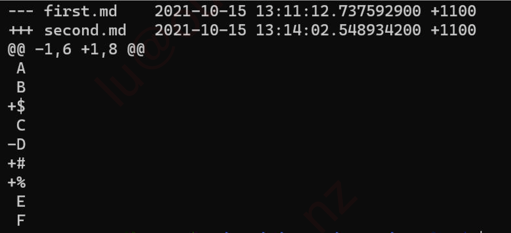

# Git 简答作业

## 1. `diff -u` 命令输出分析

**题目描述：**  
Suppose you had a file, called `first.md`, and you made a copy of this file, named it `second.md` and made some changes to it. Next, suppose you ran `diff -u first.md second.md`.

- `first.md` 的内容为：

A B C D E F

- `diff` 命令输出如下：

**`second.md` 的内容：**

A B $ C % E F

---

## 2. Staging 区的文件移除  

**题目：**  
(True or False) If you accidentally add a file to the staging area, you can remove it using `git reset`. For example, if you accidentally add `third.md`, but do not want it to be committed yet, run `git reset third.md` and the file will be removed from the staging area, **but it will still be in your working directory**.

**答案：**  
**True.** Running `git reset third.md` removes the file from the staging area but keeps it in the working directory.

---

## 3. `git reset` 和 `git revert` 的用途

**题目：**  
(True or False) The commands `git reset` and `git revert` can only be used to undo commits in the git repository.

**答案：**  
**False.** `git reset` can be used to modify the staging area and working directory as well. `git revert` is used to undo commits by creating a new commit.

---

## 4. `git checkout` 用于回滚到特定的提交  

**题目：**  
(True or False) The command `git checkout` can be used to roll back to a certain commit hash (check the documentation if you are unsure).

**答案：**  
**True.** `git checkout <commit-hash>` allows you to move the HEAD to a specific commit.

---

## 5. 提交前是否需要添加到 Staging

**题目：**  
(True or False) We cannot commit changes in the working directory directly to the repository without adding it to the staging index first (read the documentation if you are unsure).

**答案：**  
**True.** Git requires changes to be staged (added to the index) before they can be committed.

---

## 6. `git log -p` 和 `git log` 输出对比  

**题目：**  
(True or False) `git log -p` and `git log` will give you the same output.

**答案：**  
**False.** `git log -p` includes the patch information (differences in code), whereas `git log` shows a summary of commits.

---

## 7. `git log --oneline` 和 `git log --stat` 输出对比

**题目：**  
(True or False) `git log --oneline` and `git log --stat` will give you the same output.

**答案：**  
**False.** `git log --oneline` shows a concise one-line summary of each commit, whereas `git log --stat` provides statistics about changes made in each commit.

---

## 8. `git revert` 和 `git reset` 的使用推荐  

**题目：**  
(True or False) It is recommended that in most cases we should use `git revert` rather than `git reset` to undo commits because `git revert` is safer.

**答案：**  
**True.** `git revert` creates a new commit to undo changes, preserving the history, whereas `git reset` rewrites history, which can be unsafe in collaborative environments.
